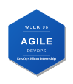
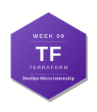
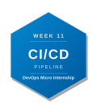
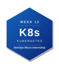

# DevOps Micro Internship with Agentic AI — My Journey


> 👋 **New here?** Read the [submission instructions](./onboarding) first — how to fork, fill in, and submit your assignments.
> Find all the required links & assignment guidelines from here [Required links](./dmi_cohort3_resources.md)

---

## About Me

| | |
|---|---|
| **Name** | Silas Nyarko |
| **LinkedIn** | (https://www.linkedin.com/in/silas-nyarko) |
| **Location** | Accra, Ghana |
| **Background** | Cloud, DevOps & Networking |
| **Goal** | To gain Hands on experience in cloud and DevOps|

---

## About the Program

**DevOps Micro Internship with Agentic AI** is a 14-week mentor-led cohort program by [Pravin Mishra](https://www.linkedin.com/in/pravin-mishra-aws-trainer/) — Cloud, DevOps & AI consultant with 15+ years of experience, 5,000+ learners trained, and 26K+ LinkedIn followers.

This is not a course. It is an internship-style program — real deployments, real pipelines, real evidence reviewed by mentors every week.

- 🌐 Program Website: https://dmi.pravinmishra.com?utm_source=github&utm_medium=readme
- 💬 Discord Community: https://discord.pravinmishra.com?utm_source=github&utm_medium=readme
- 📺 YouTube: [Pravin Mishra](https://www.youtube.com/@awswithpravinmishra)
- 🔗 Instructor: [LinkedIn](https://www.linkedin.com/in/pravin-mishra-aws-trainer/)

---

## 🏆 Achievements

### Champion of the Week

<!-- If you were named Champion of the Week, add the badge below and link to your LinkedIn post -->

| Week | Award | Post |
|------|-------|------|
| <!-- e.g. Week 03 --> | <!-- 🏆 Champion of the Week --> | <!-- [LinkedIn Post](#) --> |

### Leaderboard

<!-- Add your cohort leaderboard rank here as you progress -->

> 🥇 Cohort 3 Rank: **#__** <!-- Update this each week -->

---

## My DevOps Stack

*Earn a badge each week. To unlock: remove the `<!--` and `-->` from the badge line below.*

*Share your stack:* `https://github.com/YOUR-USERNAME/devops-micro-internship-pravinmishra#my-devops-stack`

**Preview — what your full stack looks like:**

[](./week-00-internet-and-networking/)[](./week-01-success-mindset/)[](./week-02-agentic-ai/)[](./week-03-linux-and-bash-for-devops/)[](./week-04-git-and-github/)[](./week-05-devops-lifecycle/)[](./week-06-aws-cloud/)[](./week-07-azure-cloud/)[](./week-08-terraform/)[](./week-09-ansible/)[](./week-10-azure-devops/)[](./week-11-docker/)[](./week-12-kubernetes/)[](./week-13-final-project/)

---

**Your stack (uncomment each badge as you earn it):**

<!-- Week 00 → Internet & Networking Basics -->
 [](./week-00-internet-and-networking/)

<!-- Week 01 → Success Mindset -->
[](./week-01-success-mindset/)

<!-- Week 02 → Agentic AI with Claude Code -->
<](./week-02-agentic-ai/)

<!-- Week 03 → Linux & Bash for DevOps -->
<[](./week-03-linux-and-bash-for-devops/)

<!-- Week 04 → Git & GitHub -->
<](./week-04-git-and-github/) 

<!-- Week 05 → DevOps Lifecycle & Agile -->
< [](./week-05-devops-lifecycle/)

<!-- Week 06 → AWS Cloud -->
<!-- [](./week-06-aws-cloud/) -->

<!-- Week 07 → Azure Cloud -->
<!-- [](./week-07-azure-cloud/) -->

<!-- Week 08 → Terraform -->
<!-- [](./week-08-terraform/) -->

<!-- Week 09 → Ansible -->
<!-- [](./week-09-ansible/) -->

<!-- Week 10 → Azure DevOps CI/CD -->
<!-- [](./week-10-azure-devops/) -->

<!-- Week 11 → Docker -->
<!-- [](./week-11-docker/) -->

<!-- Week 12 → Kubernetes -->
<!-- [](./week-12-kubernetes/) -->

<!-- Week 13 → Final Project / Capstone -->
<!-- [](./week-13-final-project/) -->

*Complete a week → uncomment the badge → watch your stack grow.*

---

## Program Overview

| Phase | Weeks | Focus |
|-------|-------|-------|
| Foundation | 00 – 02 | Networking, Mindset, Agentic AI |
| Core DevOps | 03 – 05 | Linux & Bash, Git, DevOps Lifecycle |
| Cloud | 06 – 07 | AWS & Azure Real Deployments |
| Automation | 08 – 10 | Terraform, Ansible, CI/CD |
| Containers | 11 – 12 | Docker & Kubernetes |
| Capstone | 13 | Final Project |

---

## Weekly Progress

| Week | Topic | Status | Assignment | LinkedIn Post | Blog Post |
|------|-------|--------|------------|---------------|-----------|
| 00 | Internet & Networking Basics |  ✅ Completed  |✅ Solved | [LinkedIn Post](https://www.linkedin.com/posts/silas-nyarko_week-00-internet-and-networking-devops-micro-internship) | [Blog Post](https://medium.com/@nyarkosilas222/internet-and-networking-fundamentals) |
| 01 | Success Mindset |✅ Completed | ✅ Solved| [LinkedIn Post](https://www.linkedin.com/posts/silas-nyarko_join-the-dmi-devops-micro-internship-share-7477831861067472896-X7mt/?utm_source=share&utm_medium=member_desktop&rcm=ACoAAC77mYABXwQj5VAsAS-zzzdbpmvsIZLeP7U) | — |
| 02 | Agentic AI with Claude Code |✅ Completed |  ✅ Solved | [LinkedIn Post](https://www.linkedin.com/posts/silas-nyarko_dmibypravinmishra-agenticai-claudecode-activity-7481402499652972546-prQ_?utm_source=share&utm_medium=member_desktop&rcm=ACoAAC77mYABXwQj5VAsAS-zzzdbpmvsIZLeP7U) | [Blog Post](https://medium.com/@nyarkosilas222/week-2-of-devops-micro-internship-9baed88e5ed5) |
| 03 | Linux & Bash for DevOps | ✅ Completed |✅ Solved | [LinkedIn Post](https://www.linkedin.com/posts/silas-nyarko_dmi-cohort-4-live-micro-internship-waiting-share-7483869993701482496-V_TA/?utm_source=share&utm_medium=member_desktop&rcm=ACoAAC77mYABXwQj5VAsAS-zzzdbpmvsIZLeP7U) | [Blog Post](https://medium.com/@nyarkosilas222/beyond-regex-why-your-devops-pipeline-needs-both-git-hooks-and-agentic-ai-2c0ea0337a3f) |
| 04 | Git & GitHub | ✅ Completed | ✅ Solved | [LinkedIn Post](https://www.linkedin.com/posts/silas-nyarko_dmi-devops-micro-internship-with-agentic-share-7486877737366929409-7sqN/?utm_source=share&utm_medium=member_desktop&rcm=ACoAAC77mYABXwQj5VAsAS-zzzdbpmvsIZLeP7U) | [Blog Post](https://medium.com/@nyarkosilas222/beyond-regex-why-your-devops-pipeline-needs-both-git-hooks-and-agentic-ai-2c0ea0337a3f) |
| 05 | DevOps Lifecycle & Agile | ✅ Completed | ✅ Solved | [LinkedIn Post](https://www.linkedin.com/posts/silas-nyarko_devops-agile-jira-share-7494127317221376001-em9P/?utm_source=share&utm_medium=member_desktop&rcm=ACoAAC77mYABXwQj5VAsAS-zzzdbpmvsIZLeP7U) | [Blog Post](https://medium.com/@nyarkosilas222/week-05-learning-the-devops-lifecycle-through-agile-and-jira-b2852c3820c2) |
| 06 | AWS Cloud | ✅ Completed | ✅ Solved | [LinkedIn Post](https://lnkd.in/p/dZBrZk7a) | [Blog Post](https://medium.com/@nyarkosilas222/building-automated-cloud-security-audits-comparing-aws-and-azure-security-controls-1ab6d94b9bb0) |
| 07 | Azure Cloud | ✅ Completed | ✅ Solved | [LinkedIn Post](https://lnkd.in/p/daVYCN3a) | [Blog Post](https://medium.com/@nyarkosilas222/building-automated-cloud-security-audits-comparing-aws-and-azure-security-controls-199754f23930) |
| 08 | Terraform | ⬜ Not Started | ⏳ Pending | — | — |
| 09 | Ansible | ⬜ Not Started | ⏳ Pending | — | — |
| 10 | Azure DevOps (CI/CD) | ⬜ Not Started | ⏳ Pending | — | — |
| 11 | Docker | ⬜ Not Started | ⏳ Pending | — | — |
| 12 | Kubernetes | ⬜ Not Started | ⏳ Pending | — | — |
| 13 | Final Project | ⬜ Not Started | ⏳ Pending | — | — |

**Status:** ⬜ Not Started &nbsp;|&nbsp; 🔄 In Progress &nbsp;|&nbsp; ✅ Completed<br>
**Assignment:** ⏳ Pending &nbsp;|&nbsp; ✅ Solved

---

## Certificate of Completion

*Awarded upon completing Week 13 — Final Project.*

<!-- Drop your certificate image here -->

---

## Footer & Dynamic Deployment Date

### Overview
The portfolio website includes a footer that displays the version and current deployment date. The footer is implemented using:
- **HTML**: Footer markup with placeholder for dynamic date
- **TypeScript** (`footer.ts`): Source logic for date formatting and initialization
- **JavaScript** (`footer.js`): Compiled JavaScript executed in the browser

### Footer Structure
The footer appears at the bottom of the page with the text format:

### Dynamic Deployment Date Implementation

#### How It Works
1. **Date Formatting Function** (`formatDeploymentDate()`):
   - Retrieves the current date at runtime
   - Formats it as "DD Mon YYYY" (e.g., "30 Jul 2026")
   - Uses `String.padStart()` to ensure 2-digit day format
   - Uses `toLocaleString()` to get 3-letter month abbreviation

2. **Footer Initialization** (`initializeFooter()`):
   - Waits for DOM to be fully loaded via `DOMContentLoaded` event
   - Locates the `#deploy-date` element in the HTML
   - Updates the element with the formatted current date

3. **Browser Execution**:
   - `footer.js` is loaded at the end of the HTML body
   - The script runs when the page loads
   - Date is generated dynamically—always reflects the current date when page is viewed

#### Files Involved
- `index.html`: Footer HTML structure with `<span id="deploy-date">`
- `footer.ts`: TypeScript source code (main logic)
- `footer.js`: Compiled JavaScript (what the browser executes)
- `style.css`: Footer styling (dark background, centered, white text)

### Testing & Verification

#### Local Testing
1. Open `index.html` in a web browser (or use VS Code Live Server)
2. Scroll to the bottom of the page
3. Verify the footer displays the current date in "DD Mon YYYY" format
4. Refresh the page multiple times—the date should always reflect today's date

#### Browser Developer Tools
```javascript
// Open DevTools Console (F12) and run:
document.getElementById('deploy-date').textContent
// Should output: "30 Jul 2026" (or current date)
```

### TypeScript Compilation
If modifying `footer.ts`:
```bash
# Compile TypeScript to JavaScript
tsc footer.ts --target es6 --lib es2015,dom

# Or watch for changes:
tsc footer.ts --target es6 --lib es2015,dom --watch
```

This generates `footer.js` from the TypeScript source.

---

## Connect

If you found this repo useful or want to follow my DevOps journey:

- ⭐ Star this repo
- 🔗 Connect with me on [LinkedIn](#)
- 🌐 Learn more about the program: https://dmi.pravinmishra.com?utm_source=github&utm_medium=readme
- 💬 Join the community: https://discord.pravinmishra.com?utm_source=github&utm_medium=readme
