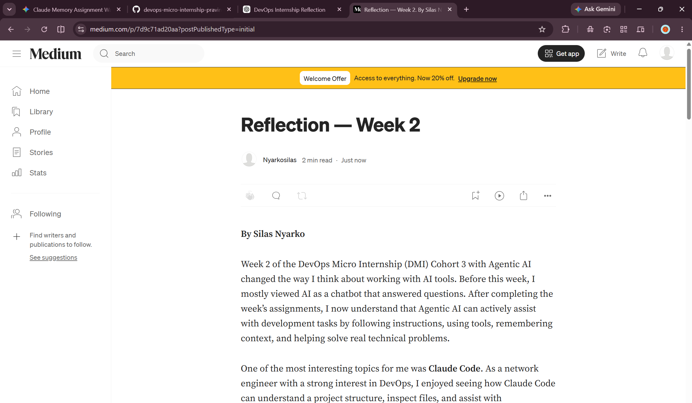
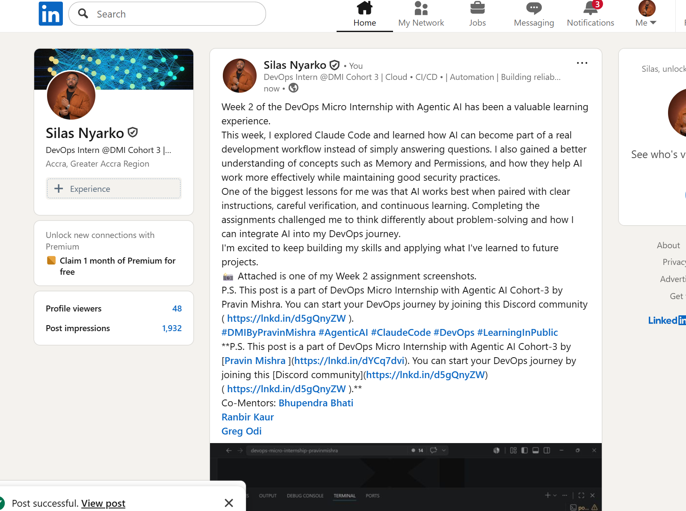

# Assignment 8 — Week 2 Reflection Blog

Part of the DevOps Micro Internship (DMI) Cohort 3 with Agentic AI

---

# Purpose

In this assignment, you will reflect on your Week 2 learning journey and write a short blog capturing your experience working with Agentic AI tools such as Claude Code, Skills, Subagents, MCP, Hooks, Permissions, and Memory.

You will also publish a LinkedIn post summarizing your learning and share both links for evaluation.

---

# Task 1 — Write Your Reflection Blog

## Goal

Write a reflection blog covering your Week 2 learning experience.

### Blog Requirements

Your blog must include:

* Title: **Reflection – Week 2**
* Minimum 300 words
* At least 2–3 topics from Week 2 (Claude Code, Skills, Subagents, MCP, Hooks, Permissions, Memory)
* Honest personal reflection (learning, challenges, mindset)
* One habit/system you plan to implement
* Your full name clearly visible

### Allowed Platforms

You can publish your blog on:

* Hashnode
* Medium
* Dev.to
* LinkedIn Article
* GitHub Markdown file
* Substack

---

### Evidence

#### Screenshot 1 — Blog published and visible

Add your screenshot here.

--- 

### Submission Field

Blog Link:

<<<<<<< HEAD:week-02-agentic-ai/solution-assignment-08-Week-2-reflection.md
`______________https://medium.com/@nyarkosilas222/reflection-week-2-7d9c71ad20aa____________________________`
=======
`Add your URL here`
>>>>>>> upstream/main:week-02-agentic-ai/assignment-08-week-2-reflection.md

---

# Task 2 — Create LinkedIn Post

## Goal

Share your Week 2 learning publicly on LinkedIn.

---

### LinkedIn Post Requirements

Your post must include:

* One screenshot from any Week 2 assignment
* Short reflection (what you learned or built)
* Required P.S. line exactly as given below

---

### Required P.S. Line (Must Include Exactly)

> **P.S. This post is a part of DevOps Micro Internship with Agentic AI Cohort-3 by [Pravin Mishra](https://www.linkedin.com/in/pravin-mishra-aws-trainer/). You can start your DevOps journey by joining [DMI waiting list](https://forms.gle/3hvrWJBDzsDeJoPs6) (https://forms.gle/3hvrWJBDzsDeJoPs6).**

---

### Suggested Hashtags

#DMIByPravinMishra #AgenticAI #ClaudeCode #DevOps #LearningInPublic

---

### Evidence

#### Screenshot 2 — LinkedIn post published

Add your screenshot here.

--- 

### Submission Field

LinkedIn Post Content (copy-paste here):

```
Paste your LinkedIn post content here
```

--- Week 2 of the DevOps Micro Internship with Agentic AI has been a valuable learning experience.

This week, I explored Claude Code and learned how AI can become part of a real development workflow instead of simply answering questions. I also gained a better understanding of concepts such as Memory and Permissions, and how they help AI work more effectively while maintaining good security practices.

One of the biggest lessons for me was that AI works best when paired with clear instructions, careful verification, and continuous learning. Completing the assignments challenged me to think differently about problem-solving and how I can integrate AI into my DevOps journey.

I'm excited to keep building my skills and applying what I've learned to future projects.

📸 Attached is one of my Week 2 assignment screenshots.

P.S. This post is a part of DevOps Micro Internship with Agentic AI Cohort-3 by Pravin Mishra. You can start your DevOps journey by joining this Discord community ( https://lnkd.in/d5gQnyZW ).

#DMIByPravinMishra #AgenticAI #ClaudeCode #DevOps #LearningInPublic

**P.S. This post is a part of DevOps Micro Internship with Agentic AI Cohort-3 by [Pravin Mishra ](https://lnkd.in/dYCq7dvi). You can start your DevOps journey by joining this [Discord community](https://lnkd.in/d5gQnyZW) ( https://lnkd.in/d5gQnyZW ).**

Co-Mentors: Bhupendra Bhati  

Ranbir Kaur 

Greg Odi

### LinkedIn Post Link:

<<<<<<< HEAD:week-02-agentic-ai/solution-assignment-08-Week-2-reflection.md
`______________https://www.linkedin.com/posts/silas-nyarko_dmibypravinmishra-agenticai-claudecode-activity-7481402499652972546-prQ_?utm_source=share&utm_medium=member_desktop&rcm=ACoAAC77mYABXwQj5VAsAS-zzzdbpmvsIZLeP7U____________________________`
=======
`Add your URL here`
>>>>>>> upstream/main:week-02-agentic-ai/assignment-08-week-2-reflection.md

---

# Submission Instructions

* Blog must be publicly accessible
* LinkedIn post must be visible (public or unlisted where applicable)
* All required fields must be filled
* Screenshot proofs must be added to GitHub repository
* Do not include sensitive information in blog or post

---

# Completion Checklist

* [X] Blog written with required structure
* [X] Blog includes at least 2–3 Week 2 topics
* [X] Blog is publicly accessible
* [X] LinkedIn post created
* [X] Required P.S. line included
* [X] LinkedIn post content copied in submission field
* [X] Blog link added
* [X] LinkedIn post link added
* [X] Screenshots added to GitHub repo

---

# About DMI & CloudAdvisory

DevOps Micro Internship (DMI) is a project-based DevOps program run by Pravin Mishra (The CloudAdvisory), focused on real-world execution, systems thinking, and agentic AI workflows.

It helps learners build strong DevOps foundations through hands-on experience.

---

# Resources

* 🌐 DMI Official Website: [https://pravinmishra.com/dmi](https://pravinmishra.com/dmi)
* 🎓 DevOps for Beginners (Udemy): [https://www.udemy.com/course/devops-for-beginners-docker-k8s-cloud-cicd-4-projects/](https://www.udemy.com/course/devops-for-beginners-docker-k8s-cloud-cicd-4-projects/)
* 🎓 Agentic AI DevOps with Claude Code: [https://www.udemy.com/course/ultimate-agentic-ai-devops-with-claude-code/](https://www.udemy.com/course/ultimate-agentic-ai-devops-with-claude-code/)
* 🎓 DevOps with Claude Code: Terraform, EKS, ArgoCD & Helm: [https://www.udemy.com/course/devops-with-claude-code-terraform-eks-argocd-helm/](https://www.udemy.com/course/devops-with-claude-code-terraform-eks-argocd-helm/)
* ▶️ YouTube Playlist: [https://www.youtube.com/playlist?list=PLFeSNDtI4Cho](https://www.youtube.com/playlist?list=PLFeSNDtI4Cho)
* 🔗 Pravin Mishra (LinkedIn): [https://www.linkedin.com/in/pravin-mishra-aws-trainer/](https://www.linkedin.com/in/pravin-mishra-aws-trainer/)
* 🏢 CloudAdvisory (LinkedIn): [https://www.linkedin.com/company/thecloudadvisory/](https://www.linkedin.com/company/thecloudadvisory/)

