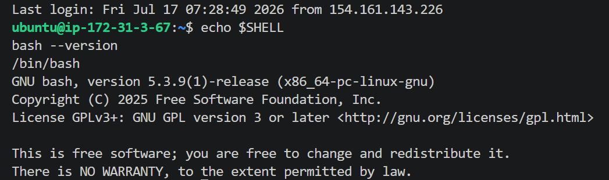

# Assignment 5 — Bash Script Automation Drill (OPS Checklist)

Part of the DevOps Micro Internship (DMI) Cohort 3 with Agentic AI

---

## Purpose

In this assignment, you will practice Bash scripting by building a series of small automation scripts covering environment setup, variables, arrays, loops, file conditionals, if-else logic, and functions. These scripts form the foundation of real-world Linux automation used in DevOps, cloud, and production support environments.

---

# Task 1 — Bash Environment & Workspace Setup

## Goal

Verify that Bash is available on your system and create a clean workspace for this assignment.

### Evidence

#### Screenshot 1 — Output of `echo $SHELL` and `bash --version`

Add your screenshot here.

(Tasks1.png)

#### Screenshot 2 — Output of `pwd` and `ls -lah` showing the scripts directory

Add your screenshot here.

(<Tasks 2-3.png>)

### Notes

Answer the following in your own words:

**1. What is Bash?**

Add your answer here.

--- Bash (Bourne Again SHell) is an command language interpreter and Unix shell. It reads and executes commands typed in a terminal or read from a script file, acting as the primary interface between the user and the Linux operating system kernel.

**2. What is the difference between shell and Bash?**

Add your answer here.

--- A shell is a broad category representing any command-line interpreter interface (like sh, dash, zsh, ksh). Bash is a specific, modernized implementation of a shell that is backwards-compatible with the original Bourne shell (sh) but includes advanced features like command history, autocompletion, and arrays.

**3. Why is it important to confirm the Bash version before writing scripts?**

Add your answer here.

--- Different Bash versions support different features. For example, associative arrays require Bash 4.0+. Confirming your version ensures compatibility so that modern scripting syntax doesn't crash on older, legacy host environments.

# Task 2 — Your First Bash Script

## Goal

Create your first Bash script, make it executable, and run it from the terminal.

### Evidence

#### Screenshot 1 — Content of `first-script.sh`

Add your screenshot here.

(<Tasks 2 1-1.png>)

#### Screenshot 2 — Output of `./first-script.sh`

Add your screenshot here.

(<Tasks 2 2-1.png>)

#### Screenshot 3 — Output of `ls -l first-script.sh` showing executable permission

Add your screenshot here.

(<Tasks 2 3-1.png>)

### Notes

Answer the following in your own words:

**1. What is the purpose of `#!/bin/bash`?**

Add your answer here.

--- This is called a shebang. It tells the operating system's program loader to interpret and execute the rest of the script file using the Bash binary located at /bin/bash instead of the system's default system shell.

**2. Why do we use `chmod +x` before running a script?**

Add your answer here.

--- By default, newly created text files in Linux do not have "execute" permissions for security reasons. Running chmod +x adds the execution bit to the file metadata, letting the kernel run it directly as an executable program.

**3. What is the difference between running a script using `./script.sh` and `bash script.sh`?**

Add your answer here.

--- ./script.sh executes the file directly, relying on the shebang (#!/bin/bash) inside the file and requiring the file to have executable permissions (+x). Running bash script.sh explicitly invokes a new Bash process to run the file, bypassing the shebang interpreter declaration and allowing execution even if the file lacks the +x permission.

# Task 3 — Variables: User Information Script

## Goal

Use variables to store and display user-related information.

### Evidence

#### Screenshot 1 — Content of `user-info.sh`

Add your screenshot here.

(<Tasks 3 1-1.png>)

#### Screenshot 2 — Output of `./user-info.sh`

Add your screenshot here.

(<Tasks 3 2-1.png>)

### Notes

Answer the following in your own words:

**1. What is a variable in Bash?**

Add your answer here.

--- A variable is a temporary storage location in memory, represented by a name, that holds a text string or numeric value. It can be referenced and manipulated throughout the script's execution.

**2. Why should we avoid spaces around the `=` sign when creating variables?**

Add your answer here.

--- Bash parses spaces as argument separators. Writing NAME = "Silas" causes Bash to treat NAME as a command/program to run, with = and "Silas" passed as its arguments, resulting in a "command not found" syntax error

**3. How do you access the value stored inside a Bash variable?**

Add your answer here.

--- You access it by prefixing the variable name with a dollar sign $, such as $FULL_NAME, or by using protective braces like ${FULL_NAME} when placing it adjacent to other text characters.

# Task 4 — Arrays & Loops: Tools Checklist Script

## Goal

Use arrays and loops to print a checklist of tools used in Bash scripting.

### Evidence

#### Screenshot 1 — Content of `tools-checklist.sh`

Add your screenshot here.

(<Tasks 4 1-1.png>)

#### Screenshot 2 — Output of `./tools-checklist.sh`

Add your screenshot here.

(<Tasks 4 2-1.png>)

### Notes

Answer the following in your own words:

**1. What is an array in Bash?**

Add your answer here.

--- An array is a variable containing multiple values indexed by numbers (starting at 0). It acts as an ordered list of elements that can be managed together.

**2. Why are arrays useful in scripts?**

Add your answer here.

--- They let you group related data (like a list of server IPs, package names, or files) under a single variable name and iterate over them programmatically using loops instead of copying commands.

**3. What does `"${tools[@]}"` mean?**

Add your answer here.

--- The @ symbol acts as a wild-card index, and surrounding it in double quotes expands all elements of the tools array as distinct, individually quoted arguments, preserving any spaces within individual element names.

**4. What is the purpose of the `for` loop in this script?**

Add your answer here.

--- The for loop automates repetition by stepping through the elements of the array one by one, executing the nested code block exactly once for each tool.

# Task 5 — Loops: Number Counter Script

## Goal

Use loops to repeat a task multiple times.

### Evidence

#### Screenshot 1 — Content of `counter.sh`

Add your screenshot here.

(<Tasks 5 1-1.png>)

#### Screenshot 2 — Output of `./counter.sh`

Add your screenshot here.

(<Tasks 5 2-1.png>)

### Notes

Answer the following in your own words:

**1. What is a loop?**

Add your answer here.

--- A loop is a control structure that repeatedly executes a block of code as long as a specified condition is true, or until it has iterated over a designated sequence of values.

**2. Why do we use loops in Bash scripting?**

Add your answer here.

--- Loops eliminate repetitive manual code. They allow you to automate tasks like processing hundreds of logs, pinging multiple servers, or checking the status of services without writing separate lines of code for each action.

**3. How many times did the loop run in your script?**

Add your answer here.

--- The loop ran exactly 5 times (stepping sequentially through the numbers 1, 2, 3, 4, and 5).

**4. What would you change if you wanted the loop to run 10 times?**

Add your answer here.

--- I would modify the range expression in the loop sequence block from {1..5} to {1..10}.

# Task 6 — Files & Conditionals: File Validation Script

## Goal

Use file checks and conditionals to verify whether files and directories exist.

### Evidence

#### Screenshot 1 — Output of `ls -lah ../test-folder`

Add your screenshot here.

(<Tasks 6 1-1.png>)

#### Screenshot 2 — Content of `file-check.sh`

Add your screenshot here.

(<Tasks 6 2-1.png>)

#### Screenshot 3 — Output of `./file-check.sh`

Add your screenshot here.

(<Tasks 6 3-1.png>)

### Notes

Answer the following in your own words:

**1. What does `-d` check in Bash?**

Add your answer here.

--- The -d flag is a conditional file test operator that evaluates to true if the specified path exists and is a directory.

**2. What does `-f` check in Bash?**

Add your answer here.

--- The -f flag evaluates to true if the specified path exists and is a regular file (not a directory or special device link).

**3. Why should file and directory paths be stored in variables?**

Add your answer here.

--- Storing paths in variables makes your code modular and easier to maintain. If a file path changes later, you only have to update it in one place (the variable declaration) instead of finding and replacing it across multiple lines.

**4. What happens if the file does not exist?**

Add your answer here.

--- The [ -f "$TARGET_FILE" ] condition evaluates to false, which skips the then block and runs the code under the else block, printing the [FAIL] warning message.

# Task 7 — Conditionals: Pass or Retry Script

## Goal

Use if-else conditionals to make decisions based on a variable value.

### Evidence

#### Screenshot 1 — Content of `score-check.sh` with `score=85`

Add your screenshot here.

(<Tasks 7 1-1.png>)

#### Screenshot 2 — Output showing `Result: Pass`

Add your screenshot here.

(<Tasks 7 2-1.png>)

#### Screenshot 3 — Content of `score-check.sh` with `score=55`

Add your screenshot here.

(<Tasks 7 3.png>)

#### Screenshot 4 — Output showing `Result: Retry`

Add your screenshot here.

(<Tasks 7 4.png>)

### Notes

Answer the following in your own words:

**1. What is the purpose of if-else in Bash?**

Add your answer here.

--- It allows you to introduce decision-making logic into your script. It executes different blocks of code depending on whether a conditional expression evaluates to true or false.

**2. What does `-ge` mean?**

Add your answer here.

--- -ge stands for Greater than or Equal to. It is used for comparing numeric integer values in Bash.

**3. Why should conditions be tested with different values?**

Add your answer here.

--- Testing with different values (like boundary, passing, and failing values) is a best practice to ensure your conditional branch logic works correctly under all scenarios and doesn't run execution paths with unexpected errors.

**4. How can conditionals help in automation scripts?**

Add your answer here.

--- Conditionals allow automation scripts to adapt dynamically to real-time conditions. For example, you can check if a server has enough disk space before deploying, verify if a backup succeeded before deleting the original file, or restart a service only if its status check fails.

# Task 8 — Functions: Final Bash Automation Script

## Goal

Create a final Bash script using functions to organize reusable code.

### Evidence

#### Screenshot 1 — Content of `final-automation.sh`

Add your screenshot here.

(<Tasks 8 1.png>)

#### Screenshot 2 — Output of `./final-automation.sh`

Add your screenshot here.

(<Tasks 8 2.png>)

#### Screenshot 3 — Output of `ls -lah` showing all created scripts

Add your screenshot here.

(<Tasks 8 2-1.png>)

### Notes

Answer the following in your own words:

**1. What is a function in Bash?**

Add your answer here.

--- A function is a self-contained, named block of reusable code. Once declared, it can be executed multiple times throughout a script simply by calling its name.

**2. Why are functions useful in scripts?**

Add your answer here.

--- They improve code readability, reduce duplication (the DRY principle—Don't Repeat Yourself), and make scripts easier to debug by breaking complex automation scripts into small, modular steps.

**3. Which functions did you create in this script?**

Add your answer here.

--- I created three functions:

welcome_user(): Prints a personalized welcome banner with my name, cohort, and timestamp.

system_health(): Performs a quick system uptime check.

show_tools(): Loops through my array of DevOps tools and prints their verification statuses.

**4. How does this final script combine variables, arrays, loops, conditionals, files, and functions?**

Add your answer here.

--- This script uses functions to organize the execution flow, pulls system values into global variables, defines a collection of tools in an array, iterates over those tools using a for loop, and integrates system commands to check and output real-time file system state metrics.

# LinkedIn Post (Required)

## Evidence

#### LinkedIn Post URL

Paste your LinkedIn post URL here:

<<<<<<< HEAD:week-03-linux-for-devops/assignment-05-bash-script-automation-drill-ops-checklist.md
`_________________https://www.linkedin.com/posts/silas-nyarko_milestone-unlocked-leveling-up-my-bash-share-7483843351029608448-nryQ/?utm_source=share&utm_medium=member_desktop&rcm=ACoAAC77mYABXwQj5VAsAS-zzzdbpmvsIZLeP7U_________`
=======
`Add your URL here`
>>>>>>> upstream/main:week-03-linux-and-bash-for-devops/assignment-05-bash-script-automation-drill-ops-checklist.md

---

#### Screenshot — Published LinkedIn post

Add your screenshot here.

--- 

# Submission Instructions

- Add all required screenshots in your submission
- Full name must be visible in required screenshots
- All script files must be created and run successfully
- Required notes must be answered clearly for every task
- Do not expose sensitive information (keys, passwords, credentials)

---

# Completion Checklist

- [X] Task 1: Environment setup verified, workspace created (Screenshots 1–2, Notes answered)
- [X] Task 2: First script created, executed, permissions verified (Screenshots 1–3, Notes answered)
- [X] Task 3: Variables script created and run (Screenshots 1–2, Notes answered)
- [X] Task 4: Arrays and loops script created and run (Screenshots 1–2, Notes answered)
- [X] Task 5: Counter loop script created and run (Screenshots 1–2, Notes answered)
- [X] Task 6: File validation script created and run (Screenshots 1–3, Notes answered)
- [X] Task 7: Pass/Retry conditional script tested with both values (Screenshots 1–4, Notes answered)
- [X] Task 8: Final automation script created and run (Screenshots 1–3, Notes answered)
- [X] All scripts run without errors
- [X] Full Name visible in all required screenshots
- [X] LinkedIn post published and URL submitted
- [X] No sensitive data exposed

---

## 📌 About DMI & CloudAdvisory

DevOps Micro Internship (DMI) is a project-based DevOps program run by Pravin Mishra (The CloudAdvisory) focused on real-world execution, systems thinking, and career readiness.

It helps learners build strong DevOps foundations with hands-on experience.

---

## 📌 Resources

- 🌐 DMI Official Website: https://pravinmishra.com/dmi  
- 🎓 DevOps for Beginners (Udemy): https://www.udemy.com/course/devops-for-beginners-docker-k8s-cloud-cicd-4-projects/  
- 🎓 Agentic AI DevOps with Claude Code: https://www.udemy.com/course/ultimate-agentic-ai-devops-with-claude-code/  
- 🎓 DevOps with Claude Code: Terraform, EKS, ArgoCD & Helm: https://www.udemy.com/course/devops-with-claude-code-terraform-eks-argocd-helm/  
- ▶️ YouTube Playlist: https://www.youtube.com/playlist?list=PLFeSNDtI4Cho  
- 🔗 Pravin Mishra (LinkedIn): https://www.linkedin.com/in/pravin-mishra-aws-trainer/  
- 🏢 CloudAdvisory (LinkedIn): https://www.linkedin.com/company/thecloudadvisory/

---

*This submission is part of DevOps Micro Internship (DMI) Cohort 3 — Agentic AI Track.*