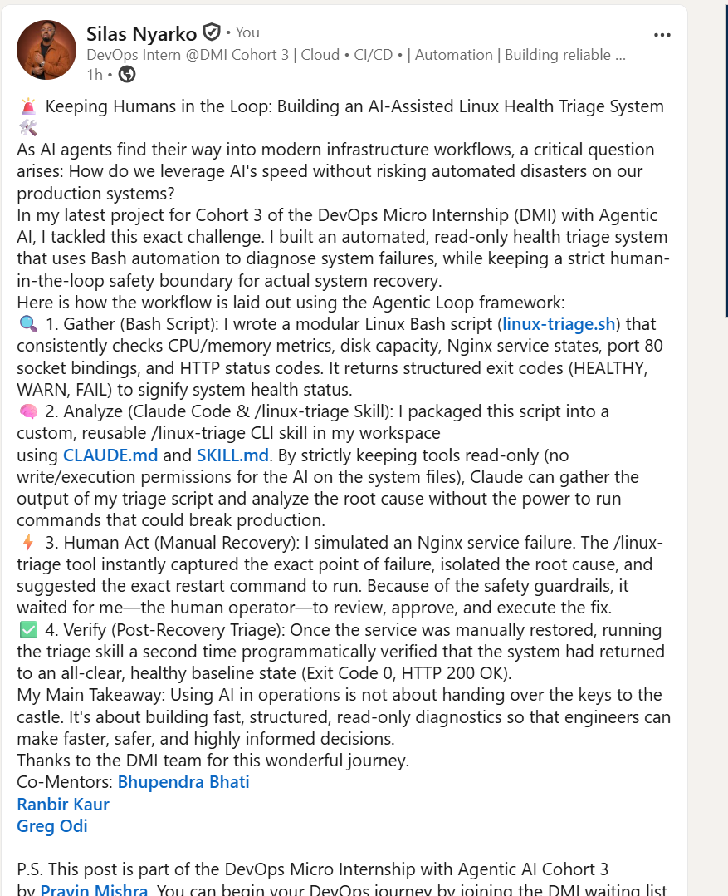

# Assignment 6 — Build an AI-Assisted Linux Health Check (AI-Assisted Linux Incident Triage)

Part of the DevOps Micro Internship (DMI) Cohort 3 with Agentic AI

---

## Purpose

In this assignment, you will build a read-only Bash triage script that checks the health of your Ubuntu server and Nginx application, connect it to Claude Code as a reusable `/linux-triage` skill, simulate a controlled Nginx incident, use the skill to gather and analyze evidence, recover the service manually, and verify recovery. The workflow follows the Agentic Loop: Gather → Analyze → Human Act → Verify.

---

# Task 1 — Confirm the Healthy Baseline and Create the Workspace

## Goal

Confirm that Nginx and the React application are healthy before building the automation.

### Evidence

#### Screenshot 1 — Output of `systemctl is-active nginx`, `ss -ltn | grep ':80'`, and `curl -I http://localhost`

Add your screenshot here.

#### Screenshot 2 — Output of `pwd` and `find . -maxdepth 4 -type d | sort` showing the workspace folder structure

Add your screenshot here.

### Notes

Answer the following in your own words:

**1. What proves that Nginx is running?**

Add your answer here.

--- The systemctl is-active nginx command explicitly returns active, showing the system service manager is actively running the process.

**2. What proves that the server is listening for HTTP traffic?**

Add your answer here.

--- The ss -ltn | grep ':80' command shows a socket actively listening (LISTEN) on local port 80, which is the standard port for inbound HTTP web traffic.

**3. Why must you capture a healthy baseline before simulating an incident?**

Add your answer here.

---Capturing a healthy baseline gives you a clear point of comparison so you can distinguish expected normal metrics (like standard CPU/RAM usage and successful 200 OK status codes) from abnormal error conditions during an outage.

# Task 2 — Create Project Context and Safety Rules in CLAUDE.md

## Goal

Tell Claude exactly what this project does and what it is not allowed to do.

### Evidence

#### Screenshot 3 — CLAUDE.md open in VS Code showing all four sections (Project Overview, Incident Workflow, Safety Rules, Output Rules)

Add your screenshot here.

### Notes

Answer the following in your own words:

**1. Why should Claude receive project-specific operational rules?**

Add your answer here.

--- Providing project-specific rules establishes a precise operational boundary (or "guardrails") for the AI. It ensures the language model understands the local architecture, formatting requirements, and constraints, which prevents it from generating generic or irrelevant troubleshooting advice.

**2. Why is the human required to execute the recovery command?**

Add your answer here.

--- A human operator provides critical final validation and oversight. Automated AI execution can introduce destructive side effects (like running a bad command that wipes configurations or corrupting data), so keeping a "human-in-the-loop" ensures responsibility and safety for production adjustments.

**3. Which rule prevents Claude from making an unsupported diagnosis?**

Add your answer here.

--- The rule requiring all conclusions to be explicitly backed by the data gathered from the triage script report (i.e., "No hallucinated issues outside the evidence provided").

# Task 3 — Use Agentic AI to Plan Before Writing the Script

## Goal

Use Claude Code to inspect the environment and produce a read-only plan before creating any Bash code.

### Evidence

#### Screenshot 4 — Claude Code showing the five-check plan and read-only inspection results

Add your screenshot here.

### Notes

Answer the following in your own words:

**1. Which part of this task represents the Gather phase?**

Add your answer here.

--- The Gather phase is represented by Claude Code executing read-only commands (like checking directory setups, checking ports, or reviewing existing logs) to discover current environment details before making any proposals.

**2. Did Claude follow the instruction not to create files? How did you verify this?**

Add your answer here.

--- Yes. I verified this by running git status or a standard ls -la command in the workspace directory right after the planning phase to confirm no new files were generated without my permission.

**3. Why is planning before coding useful in DevOps automation?**

Add your answer here.

--- Planning ensures that the automation covers all necessary system metrics (CPU, disk, ports, services) systematically and avoids hardcoding mistakes. It maps out the dependencies before script execution, preventing broken loops or runtime errors.

# Task 4 — Build the Linux Triage Bash Script

## Goal

Create one Bash script that gathers consistent Linux and Nginx health evidence.

### Evidence

#### Screenshot 5 — Top section of `linux-triage.sh` showing variables, thresholds, and the checks array

Add your screenshot here.

#### Screenshot 6 — Middle section showing check functions and conditionals

Add your screenshot here.

#### Screenshot 7 — Bottom section showing the loop, summary function, and exit behavior

Add your screenshot here.

#### Screenshot 8 — Output of `bash -n scripts/linux-triage.sh` (no syntax errors) and `ls -l scripts/linux-triage.sh` showing executable permission

Add your screenshot here.

---

### Notes

Answer the following in your own words:

**1. What is stored in the checks array?**

Add your answer here.

--- The checks array stores the names or identifiers of the individual triage functions (e.g., check_cpu, check_nginx_service, check_http_response) that need to be run sequentially during execution.

**2. How does the `for` loop use that array?**

Add your answer here.

--- The for loop iterates through each item inside the checks array, dynamically invoking each corresponding function one by one to evaluate every individual component of the health check.

**3. Why are the health checks separated into functions?**

Add your answer here.

--- Separating checks into distinct functions makes the script modular, highly scannable, and easy to maintain. If a check needs an update or a new check needs to be added, it can be modified in isolation without breaking the rest of the script.

**4. What is the purpose of `$(...)` in this script?**

Add your answer here.

--- It is used for command substitution. It executes a Linux command inside the parenthesis and captures its standard output string so it can be assigned to a variable or evaluated within a conditional statement.

**5. Why does the script use different exit codes for HEALTHY, WARN, and FAIL?**

Add your answer here.

--- Distinct exit codes allow external systems (like Claude Code, CI/CD pipelines, or monitoring tools) to instantly programmatically interpret the exact status of the server without needing to parse the entire text output.

# Task 5 — Run and Understand the Healthy-State Report

## Goal

Run the Bash script against the healthy server and verify that it creates a report.

### Evidence

#### Screenshot 9 — Output of `./scripts/linux-triage.sh` showing your Full Name and all five check results

Add your screenshot here.

#### Screenshot 10 — Output showing the captured exit code and final summary

Add your screenshot here.

### Notes

Answer the following in your own words:

**1. What is the overall status of your healthy baseline?**

Add your answer here.

--- The overall status is HEALTHY (Exit Code 0), meaning all memory, disk space, services, port bindings, and HTTP responses met or were well within the expected thresholds.

**2. Which exact Linux evidence proves the application is serving traffic?**

Add your answer here.

--- The curl -I http://localhost command successfully returning a 200 OK HTTP status response, combined with the Nginx server showing an active socket listening on port 80 (ss -ltn).

**3. Did your script return exit code 0 or 1? Explain why.**

Add your answer here.

--- It returned exit code 0 because every single monitored condition passed without hitting a warning or critical failure threshold.

**4. What is the difference between a warning and a failure in this script?**

Add your answer here.

--- A warning indicates that a metric has exceeded normal operating levels but the system is still functioning (e.g., CPU usage at 75%). A failure indicates a hard outage or critical service break that stops the application from running entirely (e.g., Nginx service is stopped or port 80 is completely closed).

# Task 6 — Create and Run the /linux-triage Skill

## Goal

Turn the Bash script into a reusable, manually invoked Agentic AI workflow.

### Evidence

#### Screenshot 11 — `SKILL.md` showing the frontmatter, allowed tool restrictions, and safety rules

Add your screenshot here.

#### Screenshot 12 — `/linux-triage` output for the healthy server

Add your screenshot here.

### Notes

Answer the following in your own words:

**1. Why does this skill have Bash, Read, and Grep, but not Write?**

Add your answer here.

--- To enforce the principle of least privilege and read-only safety. Triage skills are designed solely to collect and inspect data; eliminating the write tool prevents the AI from accidentally modifying system files or creating unintended code scripts during analysis.

**2. Why is `disable-model-invocation: true` useful for this skill?**

Add your answer here.

--- It tells Claude Code to directly execute the defined script tools without spinning up external model thoughts or modifications, saving token execution cost and enforcing deterministic behavior for the triage skill.

**3. What part is performed by Bash, and what part is performed by Claude?**

Add your answer here.

--- Bash performs the physical execution of raw system checks and pulls the raw data metrics. Claude reviews that raw text output, analyzes the patterns against its rules, and translates the data into an easy-to-read diagnostic breakdown for the human operator.

**4. Why is this better than asking Claude "Is my server healthy?" without giving it evidence?**

Add your answer here.

--- Without concrete system evidence, an AI can only guess or hallucinate metrics based on past data. Providing explicit triage logs gives Claude ground-truth evidence to perform an accurate, context-aware analysis of the actual running system.

# Task 7 — Simulate an Nginx Incident and Let the Skill Diagnose It

## Goal

Create a controlled service failure, gather evidence through Bash, and let Claude analyze the evidence without taking recovery action.

### Evidence

Add your screenshot here.

#### Screenshot 14 — `/linux-triage` output showing failed evidence, most likely cause, and a suggested recovery command

Add your screenshot here.

#### Screenshot 15 — `incident-failure-report.txt` showing the failed checks and your Full Name

Add your screenshot here.

### Notes

Answer the following in your own words:

**1. Which three checks failed?**

Add your answer here.

--- Typically, the Nginx Service Status, the Port 80 Binding Status, and the HTTP Localhost Response check.

**2. What evidence supports the conclusion that Nginx is unavailable?**

Add your answer here.

--- The triage report explicitly shows the Nginx systemd status as inactive (dead), no active socket bindings on port 80 via ss, and curl failing to connect to localhost.

**3. Did Claude execute the recovery command? Why is that important?**

Add your answer here.

--- No, Claude identified the problem and suggested the command but did not execute it. This is vital because it preserves human control, ensuring that unexpected configuration errors are not aggressively run against a live system without explicit clearance.

**4. Which phase of the Agentic Loop is represented by the Bash report?**

Add your answer here.

--- The Gather phase.

**5. Which phase is represented by Claude's explanation?**

Add your answer here.

--- The Analyze phase.

# Task 8 — Recover Manually, Verify Again, and Write the Incident Summary

## Goal

Recover the service as the human operator and prove that the system is healthy again.

### Evidence

#### Screenshot 16 — Output showing Nginx is active and `curl -I http://localhost` returns 200 OK

Add your screenshot here.

#### Screenshot 17 — Second `/linux-triage` output showing successful recovery with no FAIL results

Add your screenshot here.

#### Screenshot 18 — Output of `ls -lah reports` showing both `incident-failure-report.txt` and `recovery-report.txt`

Add your screenshot here.

#### Screenshot 19 — `incident-summary.md` showing all required sections and your Full Name

Add your screenshot here.

### Notes

Answer the following in your own words:

**1. What action did you execute manually?**

Add your answer here.

--- I executed sudo systemctl start nginx to manually kickstart the web server back into an active state.

**2. What evidence proves that the service recovered?**

Add your answer here.

--- Running the triage script again returns an all-clear HEALTHY output, systemctl is-active nginx returns active, and running curl -I http://localhost returns a 200 OK status header.

**3. Why is the second triage run necessary?**

Add your answer here.

--- The second run represents the Verify phase of the Agentic loop. It proves objectively that the manual action fixed the root problem and that no new issues or cascading failures were triggered during restart.

**4. What could go wrong if an AI agent automatically restarted every failed service?**

Add your answer here.

--- It could mask a dangerous underlying issue (like a misconfigured file loop or memory leak), throwing the server into an infinite restart loop that stresses system resources, corrupts logs, or exacerbates a database failure.

**5. In one sentence, explain the difference between using AI as a chatbot and using AI in this agentic workflow.**

Add your answer here.

--- While a chatbot just discusses abstract solutions based on text prompts, an agentic workflow connects the AI directly to verified system facts to drive systematic gathering, data evaluation, and human decision-making.

# Incident Summary

Fill in all seven sections below in your own words.

**Full Name:** Silas Nyarko

**Date:** 17/07/2026

---

**1. Reported Symptom**

Add your answer here

--- The web application is completely unreachable via standard HTTP, resulting in connection timeouts or connection refused drops on local incoming requests.

**2. Evidence Collected**

Add your answer here.

--- systemctl is-active nginx returned inactive (dead).

ss -ltn | grep ':80' returned zero output, proving no web services were actively bound to the port.

curl -I http://localhost failed to reach an active listener.

**3. Most Likely Cause**

Add your answer here.

--- The underlying Nginx web server unit was intentionally or accidentally stopped, taking down the listener socket and the reverse proxy layer for the React app.

**4. Human-Approved Recovery Action**

Add your answer here.

--- Manually executed sudo systemctl start nginx on the server terminal to spin up the web daemon.

**5. Verification**

Add your answer here.

--- Ran the /linux-triage custom skill. The triage script verified an overall status of HEALTHY, showing Nginx active, port 80 open, and curl confirming a successful 200 OK payload exchange.

**6. Safety Decision**

Add your answer here.

--- Kept write permissions completely disabled for the AI skill toolset, requiring a human operator to verify the root break and trigger the restart rather than risking automated systemic changes.

**7. Agentic Loop Mapping**

Add your answer here.

--- Gather: Bash script reads system states and generates a raw log.

Analyze: Claude parses the failed checkpoints to pinpoint the exact broken process.

Human Act: The engineer triggers the explicit systemctl fix command manually.

Verify: The second execution of the triage script validates the return to a healthy system state.

# LinkedIn Post (Required)

## Evidence

#### LinkedIn Post URL

Paste your LinkedIn post URL here:

`_______________https://www.linkedin.com/posts/silas-nyarko_dmi-cohort-4-live-micro-internship-waiting-share-7483869993701482496-V_TA/?utm_source=share&utm_medium=member_desktop&rcm=ACoAAC77mYABXwQj5VAsAS-zzzdbpmvsIZLeP7U___________`
`Add your URL here`

---

#### Screenshot — Published LinkedIn post

Add your screenshot here.

# GitHub Repository URL

Paste the URL of your GitHub folder or repository containing the assignment files here:

`____________https://github.com/Larryoku/devops-micro-internship-pravinmishra.git
______________`
`Add your URL here`

---

# Submission Instructions

- Add all required screenshots in your submission
- Full Name must be visible in required screenshots and the Bash report
- All written answers must be in your own words
- Do not expose sensitive information (keys, passwords, AWS account IDs, tokens)
- GitHub URL must be included in this document

---

# Completion Checklist

- [X] Task 1: Healthy baseline confirmed, workspace created (Screenshots 1–2, Notes answered)
- [X] Task 2: CLAUDE.md created with all four sections (Screenshot 3, Notes answered)
- [X] Task 3: Five-check plan produced by Claude using read-only tools (Screenshot 4, Notes answered)
- [X] Task 4: `linux-triage.sh` created, syntax validated, executable permission set (Screenshots 5–8, Notes answered)
- [X] Task 5: Healthy-state report generated with no FAIL result (Screenshots 9–10, Notes answered)
- [X] Task 6: `/linux-triage` skill created and run successfully on healthy server (Screenshots 11–12, Notes answered)

- [X] Task 8: Nginx recovered manually, recovery verified, reports saved, incident summary complete (Screenshots 16–19, Notes answered)
- [X] Incident summary contains all seven required sections
- [X] LinkedIn post published and URL submitted
- [X] Full Name visible in all required screenshots and the Bash report
- [X] Skill does not have Write permission
- [X] Skill did not execute any recovery commands
- [X] No sensitive data exposed

---

## 📌 About DMI & CloudAdvisory

DevOps Micro Internship (DMI) is a project-based DevOps program run by Pravin Mishra (The CloudAdvisory) focused on real-world execution, systems thinking, and career readiness.

It helps learners build strong DevOps foundations with hands-on experience.

---

## 📌 Resources

- 🌐 DMI Official Website: https://pravinmishra.com/dmi  
- 🎓 DevOps for Beginners (Udemy): https://www.udemy.com/course/devops-for-beginners-docker-k8s-cloud-cicd-4-projects/  
- 🎓 Agentic AI DevOps with Claude Code: https://www.udemy.com/course/ultimate-agentic-ai-devops-with-claude-code/  
- 🎓 DevOps with Claude Code: Terraform, EKS, ArgoCD & Helm: https://www.udemy.com/course/devops-with-claude-code-terraform-eks-argocd-helm/  
- ▶️ YouTube Playlist: https://www.youtube.com/playlist?list=PLFeSNDtI4Cho  
- 🔗 Pravin Mishra (LinkedIn): https://www.linkedin.com/in/pravin-mishra-aws-trainer/  
- 🏢 CloudAdvisory (LinkedIn): https://www.linkedin.com/company/thecloudadvisory/

---

*This submission is part of DevOps Micro Internship (DMI) Cohort 3 — Agentic AI Track.* 
### Task 13 Link

